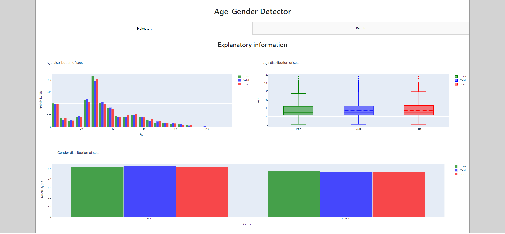
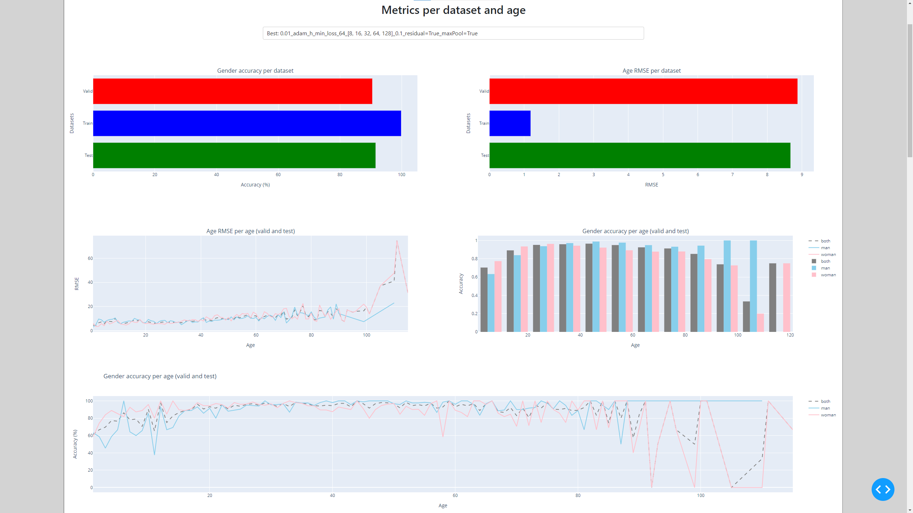
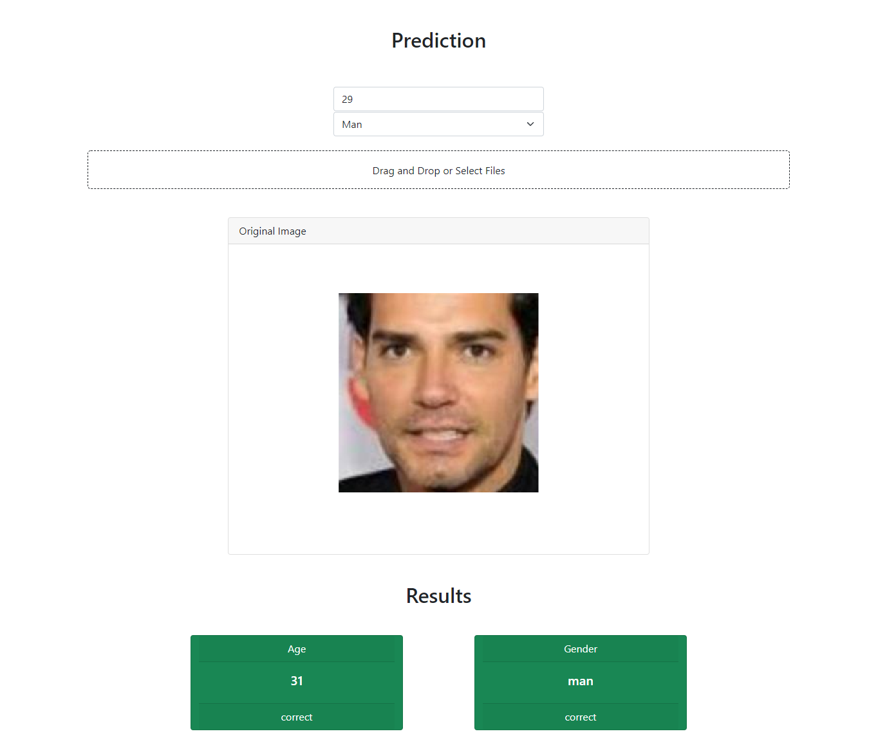
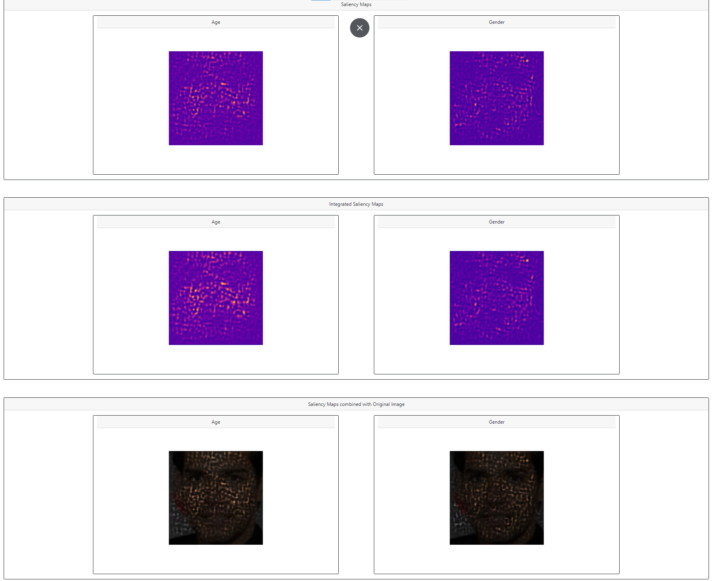

#  Age-Gender Detector

- [Age-Gender Detector](#age-gender-detector)
  - [Data](#data)
    - [Data Explanation](#data-explanation)
  - [Model Full](#model-full)
  - [Model Cropped](#model-cropped)
    - [Dash Images](#dash-images)
  

## Data

[UTKFace dataset](https://susanqq.github.io/UTKFace/)

[UTKFace dataset Kaggle](https://www.kaggle.com/jangedoo/utkface-new)

This dataset contains over 20,000 face images with annotations of
age, gender, and ethnicity. The images cover large variation in pose, facial expression, 
illumination, occlusion, resolution, etc.

### Data Explanation

If a photo is called __34_0_0_201701171712010149082.jpg.chip.jpg__, it means that the age of the individual is 34 and his gender is male. 
That is, the photo names follow the following scheme __age_gender_race_relevant_data.jpg.chip.jpg__.

Gender being 0 for male and 1 for female.

## Model Full

We have used Convolutional Neural Networks (CNN) to predict the age and gender of the **full** input image.

We have obtained the following metrics:
- Validation:
  - Gender accuracy: 0.869
  - Age MSE: 135.65
  - Age MAE: 8.54
- Test:
  - Gender accuracy: 0.878
  - Age MSE: 140.35
  - Age MAE: 8.68

## Model Cropped

We have used Convolutional Neural Networks (CNN) to predict the age and gender of the **cropped** input image.

We have obtained the following metrics:
- Validation:
  - Gender accuracy: 0.905
  - Age MSE: 78.956
- Test:
  - Gender accuracy: 0.915
  - Age MSE: 75.28

### Dash Images

Datasets data:

Model metrics (best model selected):

Prediction tool (the age has an error margin):

Saliency maps:

